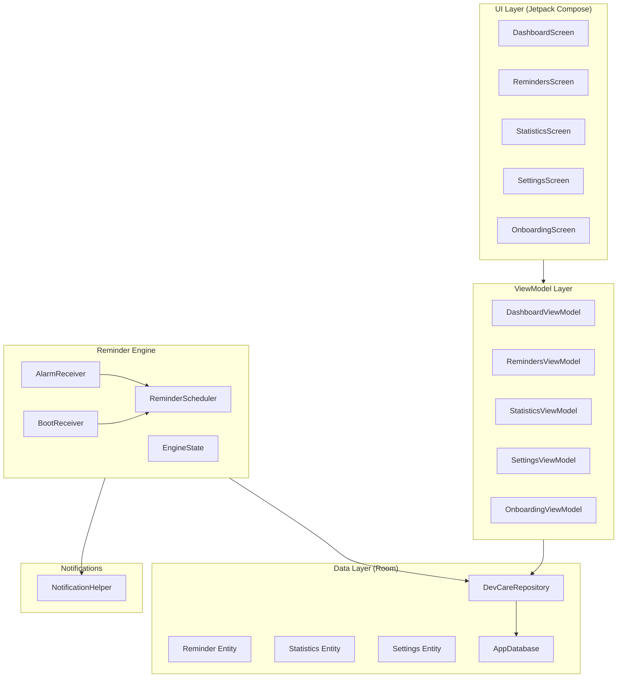

# DevCare

## Summary

Built a complete **DevCare** Android app from scratch — a lightweight, battery-efficient health reminder system for developers using Vibe Coding. The project contains **38 files** across 5 layers.

---

## Architecture

---

## Key Design Decisions (per user feedback)

| Decision | Implementation |
|---|---|
| **Alarm type** | `AlarmManager.RTC_WAKEUP` — time-based, not elapsed |
| **Doze mode** | `setExactAndAllowWhileIdle()` — fires even in Doze |
| **No repeating alarms** | Schedules exactly ONE alarm at a time |
| **3 notification channels** | `devcare_water_channel`, `devcare_break_start_channel`, `devcare_break_end_channel` |
| **Default sound** | `RingtoneManager.getDefaultUri(TYPE_NOTIFICATION)` on all channels |

---

## Files Created (38 total)

| Layer | Files |
|---|---|
| **Scaffolding** | [build.gradle.kts](file:///c:/Users/srivi/OneDrive/Documents/DevCare/build.gradle.kts) (×2), [settings.gradle.kts](file:///c:/Users/srivi/OneDrive/Documents/DevCare/settings.gradle.kts), [gradle.properties](file:///c:/Users/srivi/OneDrive/Documents/DevCare/gradle.properties), [libs.versions.toml](file:///c:/Users/srivi/OneDrive/Documents/DevCare/gradle/libs.versions.toml), [gradle-wrapper.properties](file:///c:/Users/srivi/OneDrive/Documents/DevCare/gradle/wrapper/gradle-wrapper.properties), [proguard-rules.pro](file:///c:/Users/srivi/OneDrive/Documents/DevCare/app/proguard-rules.pro), [AndroidManifest.xml](file:///c:/Users/srivi/OneDrive/Documents/DevCare/app/src/main/AndroidManifest.xml), [strings.xml](file:///c:/Users/srivi/OneDrive/Documents/DevCare/app/src/main/res/values/strings.xml), [themes.xml](file:///c:/Users/srivi/OneDrive/Documents/DevCare/app/src/main/res/values/themes.xml) |
| **Data** | [Reminder.kt](file:///c:/Users/srivi/OneDrive/Documents/DevCare/app/src/main/java/com/devcare/app/data/model/Reminder.kt), [Statistics.kt](file:///c:/Users/srivi/OneDrive/Documents/DevCare/app/src/main/java/com/devcare/app/data/model/Statistics.kt), [Settings.kt](file:///c:/Users/srivi/OneDrive/Documents/DevCare/app/src/main/java/com/devcare/app/data/model/Settings.kt), [ReminderDao.kt](file:///c:/Users/srivi/OneDrive/Documents/DevCare/app/src/main/java/com/devcare/app/data/dao/ReminderDao.kt), [StatisticsDao.kt](file:///c:/Users/srivi/OneDrive/Documents/DevCare/app/src/main/java/com/devcare/app/data/dao/StatisticsDao.kt), [SettingsDao.kt](file:///c:/Users/srivi/OneDrive/Documents/DevCare/app/src/main/java/com/devcare/app/data/dao/SettingsDao.kt), [AppDatabase.kt](file:///c:/Users/srivi/OneDrive/Documents/DevCare/app/src/main/java/com/devcare/app/data/AppDatabase.kt), [DevCareRepository.kt](file:///c:/Users/srivi/OneDrive/Documents/DevCare/app/src/main/java/com/devcare/app/data/DevCareRepository.kt) |
| **Engine** | [ReminderScheduler.kt](file:///c:/Users/srivi/OneDrive/Documents/DevCare/app/src/main/java/com/devcare/app/engine/ReminderScheduler.kt), [AlarmReceiver.kt](file:///c:/Users/srivi/OneDrive/Documents/DevCare/app/src/main/java/com/devcare/app/engine/AlarmReceiver.kt), [BootReceiver.kt](file:///c:/Users/srivi/OneDrive/Documents/DevCare/app/src/main/java/com/devcare/app/engine/BootReceiver.kt), [EngineState.kt](file:///c:/Users/srivi/OneDrive/Documents/DevCare/app/src/main/java/com/devcare/app/engine/EngineState.kt) |
| **Notifications** | [NotificationHelper.kt](file:///c:/Users/srivi/OneDrive/Documents/DevCare/app/src/main/java/com/devcare/app/notification/NotificationHelper.kt) |
| **UI** | [Theme.kt](file:///c:/Users/srivi/OneDrive/Documents/DevCare/app/src/main/java/com/devcare/app/ui/theme/Theme.kt), [DevCareApp.kt](file:///c:/Users/srivi/OneDrive/Documents/DevCare/app/src/main/java/com/devcare/app/ui/DevCareApp.kt), [MainActivity.kt](file:///c:/Users/srivi/OneDrive/Documents/DevCare/app/src/main/java/com/devcare/app/MainActivity.kt), [DevCareApplication.kt](file:///c:/Users/srivi/OneDrive/Documents/DevCare/app/src/main/java/com/devcare/app/DevCareApplication.kt), 5 screens, 5 ViewModels, [ReminderEditDialog.kt](file:///c:/Users/srivi/OneDrive/Documents/DevCare/app/src/main/java/com/devcare/app/ui/screens/ReminderEditDialog.kt) |

---

## How to Build & Run

1. **Install Android Studio** (latest stable) from [developer.android.com](https://developer.android.com/studio)
2. **Open project**: File → Open → select your project location - `c:\Users\sri\OneDrive\Documents\DevCare`
3. **Let Gradle sync** — Android Studio will download SDK & dependencies automatically
4. **Run**: Click ▶ Run on emulator or connected device (API 26+)

### First launch flow:
1. Onboarding wizard appears (4 steps)
2. Set working hours → Select reminders → Choose theme → Grant notification permission
3. Dashboard opens → Press **START** to begin receiving reminders
